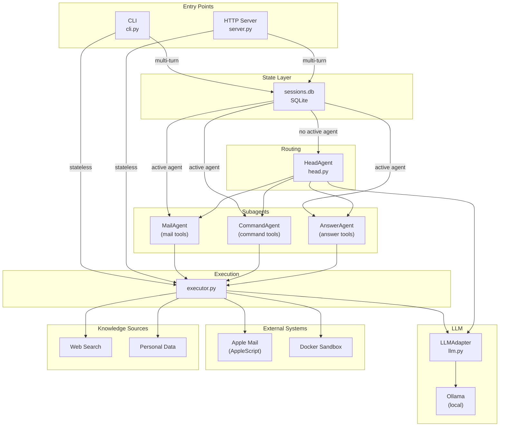
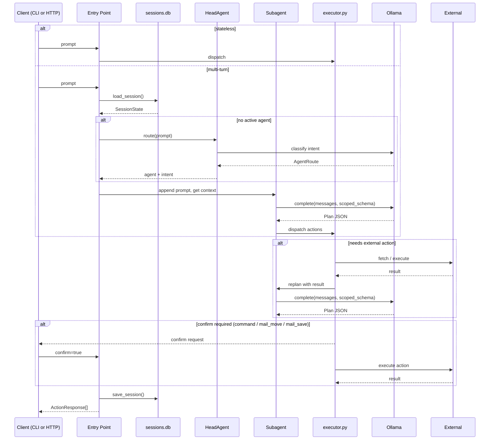

# mac-agent Architecture

## Component Overview

```mermaid
graph TD
    subgraph Entry["Entry Points"]
        CLI["CLI<br/>cli.py"]
        HTTP["HTTP Server<br/>server.py"]
    end

    subgraph State["State Layer"]
        SESSIONS["sessions.db<br/>SQLite"]
    end

    subgraph Routing["Routing"]
        HEAD["HeadAgent<br/>head.py"]
    end

    subgraph Agents["Subagents"]
        MAIL["MailAgent<br/>(mail tools)"]
        CMD["CommandAgent<br/>(command tools)"]
        ANS["AnswerAgent<br/>(answer tools)"]
    end

    subgraph Execution["Execution"]
        EXECUTOR["executor.py"]
    end

    subgraph LLM["LLM"]
        ADAPTER["LLMAdapter<br/>llm.py"]
        OLLAMA["Ollama<br/>(local)"]
    end

    subgraph External["External Systems"]
        APPLEMAIL["Apple Mail<br/>(AppleScript)"]
        DOCKER["Docker Sandbox"]
    end

    subgraph Knowledge["Knowledge Sources"]
        WEB["Web Search"]
        USERDATA["Personal Data"]
    end

    CLI -->|"stateless"| EXECUTOR
    HTTP -->|"stateless"| EXECUTOR
    CLI -->|"multi-turn"| SESSIONS
    HTTP -->|"multi-turn"| SESSIONS
    SESSIONS -->|"no active agent"| HEAD
    SESSIONS -->|"active agent"| MAIL
    SESSIONS -->|"active agent"| CMD
    SESSIONS -->|"active agent"| ANS
    HEAD --> MAIL
    HEAD --> CMD
    HEAD --> ANS

    MAIL --> EXECUTOR
    CMD --> EXECUTOR
    ANS --> EXECUTOR

    EXECUTOR --> ADAPTER
    HEAD --> ADAPTER
    ADAPTER --> OLLAMA

    EXECUTOR --> APPLEMAIL
    EXECUTOR --> DOCKER
    EXECUTOR --> WEB
    EXECUTOR --> USERDATA
```

## Runtime Flow

```mermaid
sequenceDiagram
    participant Client as Client (CLI or HTTP)
    participant Entry as Entry Point
    participant Store as sessions.db
    participant Head as HeadAgent
    participant Agent as Subagent
    participant Exec as executor.py
    participant LLM as Ollama
    participant Ext as External

    alt stateless
        Client->>Entry: prompt
        Entry->>Exec: dispatch
    else multi-turn
        Client->>Entry: prompt
        Entry->>Store: load_session()
        Store-->>Entry: SessionState

        alt no active agent
            Entry->>Head: route(prompt)
            Head->>LLM: classify intent
            LLM-->>Head: AgentRoute
            Head-->>Entry: agent + intent
        end

        Entry->>Agent: append prompt, get context
        Agent->>LLM: complete(messages, scoped_schema)
        LLM-->>Agent: Plan JSON
        Agent->>Exec: dispatch actions
    end

    alt needs external action
        Exec->>Ext: fetch / execute
        Ext-->>Exec: result
        Exec->>Agent: replan with result
        Agent->>LLM: complete(messages, scoped_schema)
        LLM-->>Agent: Plan JSON
    end

    alt confirm required (command / mail_move / mail_save)
        Exec-->>Client: confirm request
        Client->>Entry: confirm=true
        Exec->>Ext: execute action
        Ext-->>Exec: result
    end

    Entry->>Store: save_session()
    Entry-->>Client: ActionResponse[]
```
