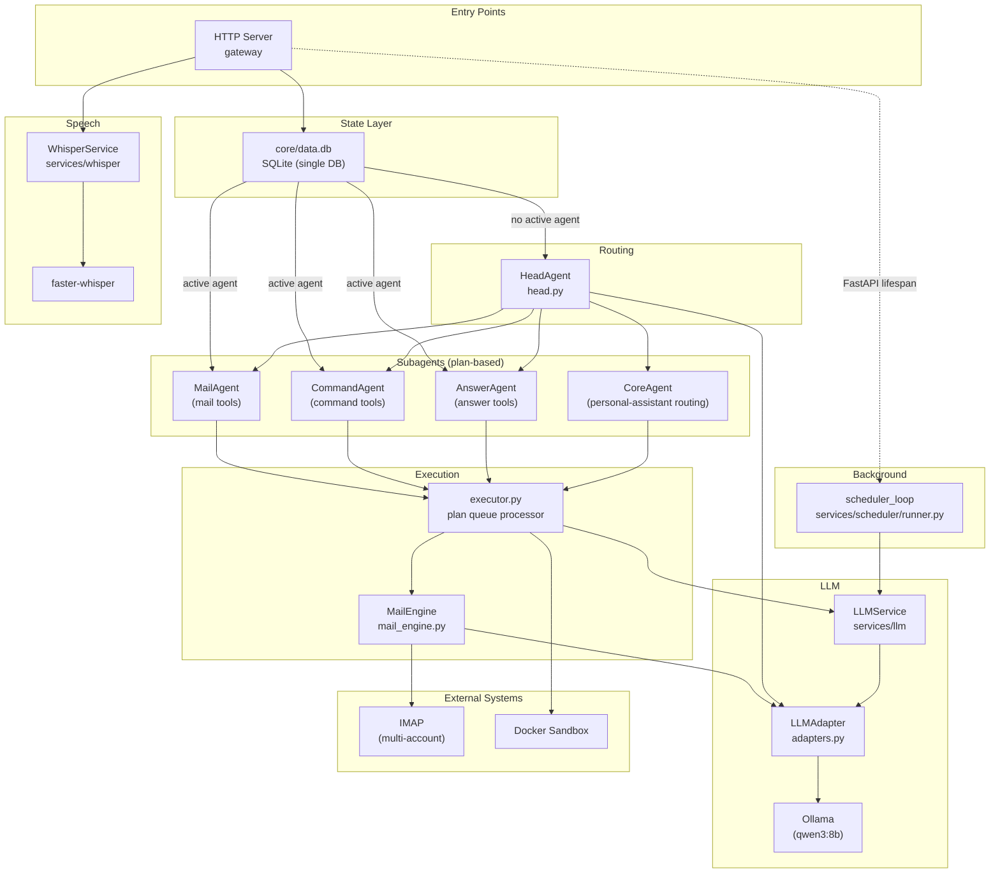

# Architecture

## System Diagram



## Key Design Decisions

- **Service architecture**: Code split into logical service packages (`auth`, `mail`, `memory`, `search`) with a thin FastAPI gateway. Each service owns its tables, exposes typed error classes, and communicates via Protocol interfaces.
- **Entry point**: `gateway/__main__.py` (FastAPI)
- **Routing**: `HeadAgent` classifies intent, dispatches to scoped subagent (Mail, Command, Answer)
- **Execution**: `AgentExecutor` runs an async tool-calling loop via `LLMService.chat()` — the LLM returns tool calls, executor runs them, feeds results back
- **Mail Engine**: `src/core/mail_engine.py` owns inbox state, display, pagination, and execution deterministically. The LLM is only called for recommendations and intent parsing with fresh context (no history accumulates)
- **LLM**: All calls go through `services/llm/` adapters (Ollama, OpenAI, Anthropic) — never call providers directly
- **JWT auth**: Tokens contain `user_id` and an AES-256-GCM encrypted `enc_key` (user's password). Sensitive fields are encrypted inside the JWT so intercepting the token reveals nothing.
- **Tools**: `tools/registry.py` defines tools; `tools/schema.py` builds per-agent JSON schemas
- **State**: Single SQLite database (`src/core/data.db`) for all tables — users, sessions, memories, calendar events, and encrypted email cache. All modules use `core/db._connect()`. Foreign keys enforced within the single DB.
- **Security**: All routes (except register/login) require JWT. Admin endpoints require JWT `is_admin` + API key. IMAP credentials encrypted at rest with AES-256-GCM, keys derived from user password via PBKDF2. `enc_key` exists only in the encrypted JWT — never persisted to disk.

## Project Layout

```
src/
  services/        Logical service packages — each owns its tables
    auth/          User identity, login, IMAP credential encryption
      service.py   AuthService — register, login, IMAP account CRUD
      store.py     UserStore — uses shared DB from core/db.py
      models.py    Pydantic models (AuthResult, ImapAccount, etc.)
      errors.py    AuthServiceError subtypes
    mail/          IMAP fetch, email display, move/delete
      service.py   MailService — thin wrapper over MailEngine
      errors.py    MailServiceError subtypes
    memory/        Per-user semantic facts with embeddings
      service.py   MemoryService + MemoryStore — owns memories table
    search/        Web search + URL browsing
      service.py   SearchService — search() and browse()
      providers.py DuckDuckGo, Searx, Google providers
    whisper/       Local speech-to-text + voice-to-agent + async jobs
      service.py   WhisperService — raw audio transcription (faster-whisper)
      store.py     WhisperStore — owns whisper_transcripts table
      agent.py     VoiceAgentService — transcribe → LLM tool pick → execute → reply
                   (6 tools: save_note, recall_notes, create_event, list_events,
                   search_web, answer)
      jobs.py      JobStore (owns voice_jobs table) + NtfyNotifier (ntfy.sh push)
      routes.py    /api/whisper/transcribe (sync),
                   /api/whisper/agent (sync agent),
                   /api/whisper/agent/async (202 + push via ntfy),
                   /api/whisper/jobs/{id} (poll async job),
                   /api/whisper/transcripts (list/delete)
      models.py    Transcription + history models
      errors.py    Whisper / transcription / voice-agent errors
    calendar/      Per-user calendar events
      service.py   CalendarService — create, list, delete
      store.py     CalendarStore — owns calendar_events table
      models.py    CreateEventRequest, CalendarEvent
      errors.py    EventNotFoundError
    news/          Personalized news ingestion + LLM curation
      service.py   NewsService — source CRUD, feed refresh, article listing
      store.py     NewsStore — owns news_sources, news_articles,
                   curated_articles, curated_ratings, source_ratings
      curator.py   NewsCurator — LLM-driven For You feed builder
    profile/       User interests, model preferences, usage signals
      service.py   ProfileService — interests, model config, signals
      store.py     ProfileStore — owns user_profile, profile_signals
    scheduler/     Background task scheduler
      service.py   SchedulerService — list/update scheduled tasks
      runner.py    scheduler_loop — async lifespan task on the gateway
      store.py     SchedulerStore — owns scheduled_tasks
    interfaces.py  Protocol definitions shared across services
    llm/           LLM abstraction layer
      service.py   LLMService — chat, complete, embeddings, streaming
      adapters.py  Pluggable adapters (Ollama, OpenAI, Anthropic)
      models.py    ToolCall, ToolResult, Plan models
      errors.py    ProviderError, TimeoutError
  gateway/         FastAPI server — routes, middleware, session management
    __main__.py    App entry point (python -m src.gateway)
    routes/        auth, memory, search, mail, chat
    session.py     SessionStore, SessionState — uses shared DB from core/db.py
    middleware.py  require_api_key, jwt_required, get_token, get_session_id
  core/            Shared utilities — no business logic
    config.py      Env-based configuration
    crypto.py      AES-GCM encryption for credentials at rest
    jwt.py         JWT sign/verify with encrypted sensitive fields
    db.py          Schema (_init_schema, _connect) — consumed by services
    executor.py    AgentExecutor — async tool-calling loop via LLMService
    mail_engine.py Hybrid mail engine (deterministic state + LLM intent parsing)
    agents/        HeadAgent + subagents (stateless routing)
    tools/         Tool definitions, registry, JSON schema builder
    docker.py      Sandbox execution
tests/          pytest suite
docs/superpowers/
  specs/        Design specifications
  plans/        Implementation plans
```

## Data Flow

### Authentication

1. User registers or logs in via `/api/account/*`
2. Server returns a signed JWT containing `user_id` and AES-256-GCM encrypted `enc_key`
3. All subsequent requests include `Authorization: Bearer <JWT>`
4. `jwt_required()` middleware validates the token and extracts `user_id`
5. Admin endpoints additionally check `is_admin` flag and `X-API-Key` header

### Mail Flow

1. User says "check my email"
2. `MailEngine.fetch()` reads emails via IMAP and stores in session
3. `MailEngine.recommend()` calls the LLM once to tag emails with actionable recommendations
4. `MailEngine.display()` renders the current page deterministically (no LLM)
5. User interacts: read, delete, next, previous, page N
6. `MailEngine.handle()` parses intent with current-page context, resolves page-relative indices to cached UIDs
7. Destructive actions return confirmation; confirmed moves update cache and redisplay
8. "done" clears the mail session

### Mail Backend

- **IMAP** (`actions/mail_imap.py`): Cross-platform backend. Configured via env vars or encrypted user credentials.
- **Multi-account**: Multiple IMAP accounts supported. First fetch asks which account. Each email carries its `account` field for targeted moves/deletes.
- **Folder resolution**: Provider-specific — `Trash` maps to `[Gmail]/Trash` on Gmail, `Trash` on Yahoo, etc.

## Database Schema

Single SQLite database at `src/core/data.db`. All tables created by `core/db._init_schema()`.

| Table | Owner | Description |
|-------|-------|-------------|
| `users` | `auth/store.py` | User accounts with password hashes and encrypted IMAP creds |
| `sessions` | `gateway/session.py` (schema in `core/db.py`) | Per-user sessions with mail engine state |
| `memories` | `memory/service.py` (schema in `core/db.py`) | Per-user semantic facts with embedding vectors |
| `calendar_events` | `calendar/store.py` | Per-user calendar events |
| `email_cache` | `core/db.py` | Encrypted email cache per user/account/mailbox |
| `email_messages` | `core/db.py` | Persistent per-message store backing the mail pages |
| `email_sync_state` | `core/db.py` | Per-account IMAP sync cursors (last UID, last sync) |
| `email_actions` | `core/db.py` | Log of user mail actions (moves/deletes/recommendations) |
| `news_sources` | `services/news/store.py` | Per-user RSS/Atom source list with topic + enabled flag |
| `news_articles` | `services/news/store.py` | Ingested articles keyed by source |
| `curated_articles` | `services/news/store.py` | LLM-selected For You picks per user |
| `curated_ratings` | `services/news/store.py` | Thumbs up/down on curated articles |
| `source_ratings` | `services/news/store.py` | Per-source ranking signal |
| `user_profile` | `services/profile/store.py` | Interests + model config per user |
| `profile_signals` | `services/profile/store.py` | Recent view/like/dismiss signals |
| `scheduled_tasks` | `services/scheduler/store.py` | Cron-style background tasks per user |

All tables use `FOREIGN KEY (user_id) REFERENCES users(user_id) ON DELETE CASCADE`.
