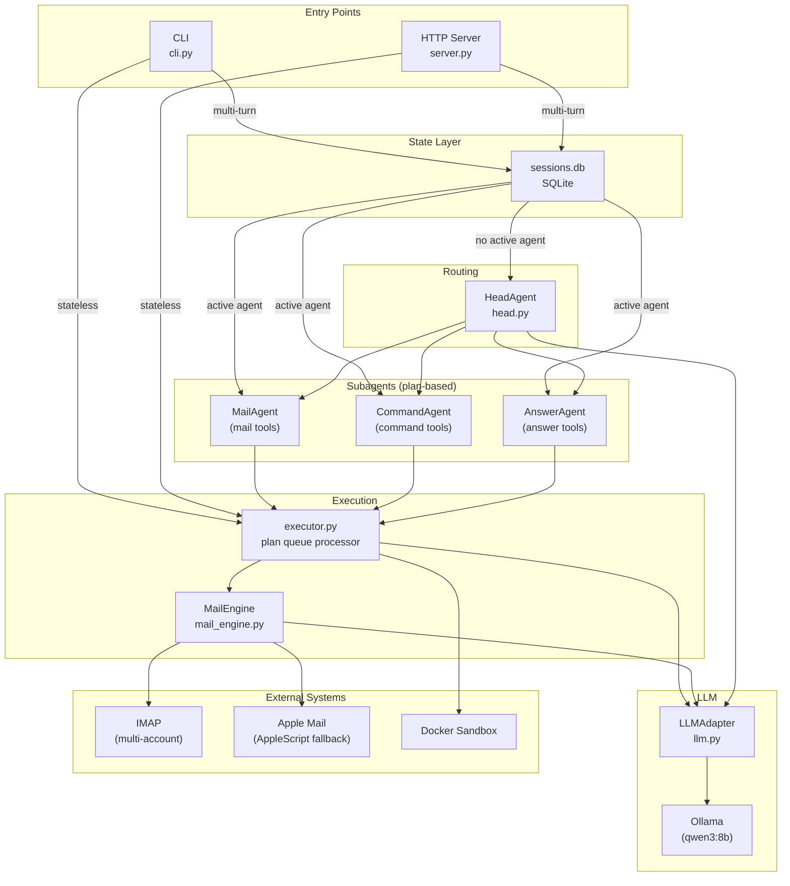
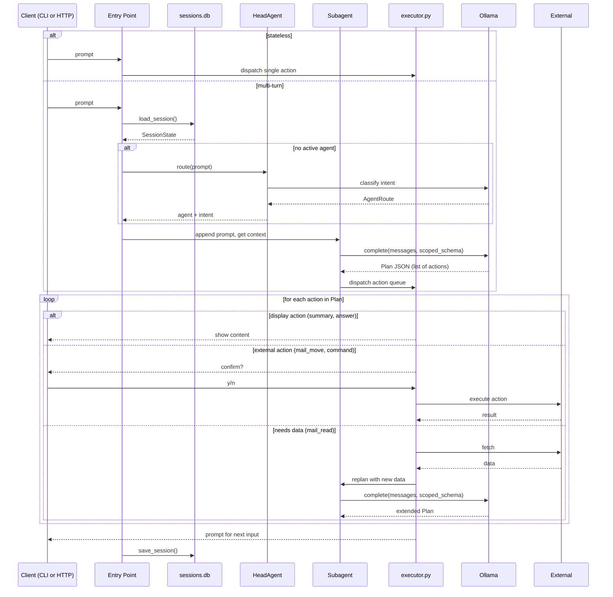

# MyDevTeam Architecture

## Component Overview



## Plan-Based Execution

All subagents return a **Plan** — an ordered list of Actions. The executor processes the full queue before returning control to the user.

```
User: "delete emails 1, 2, and 3"
  → LLM returns Plan: [mail_move(#1), mail_move(#2), mail_move(#3)]
  → Executor: confirm #1 → delete → confirm #2 → delete → confirm #3 → delete
  → Prompt user for next action
```

This avoids the single-action loop where the model would re-interpret the request after each action, leading to retries and hallucinated repeats.

## Runtime Flow



## Mail Flow

Mail uses a stateful `MailEngine` instead of an LLM-driven conversation loop. The engine owns the inbox cache, pagination, formatting, and execution. The LLM is called with fresh context only for recommendations and intent parsing.

1. User says "check my email"
2. If multiple accounts configured → ask which (Gmail / Yahoo / all)
3. `MailEngine.fetch()` reads emails with body preview and stores them in `SessionState.mail_engine`
4. `MailEngine.recommend()` tags cached emails as keep/delete/save
5. `MailEngine.display()` renders the current page deterministically
6. User interacts: read, delete, next, previous, page N
7. `MailEngine.handle()` parses intent with current-page context, resolves page-relative indices to cached UIDs, and returns structured results
8. Destructive actions return confirmation; confirmed moves update the cache and redisplay from engine state
9. User says "done" or the session is cleared → exit

Folder names are resolved per-provider: `Trash` → `[Gmail]/Trash` on Gmail, `Trash` on Yahoo.
