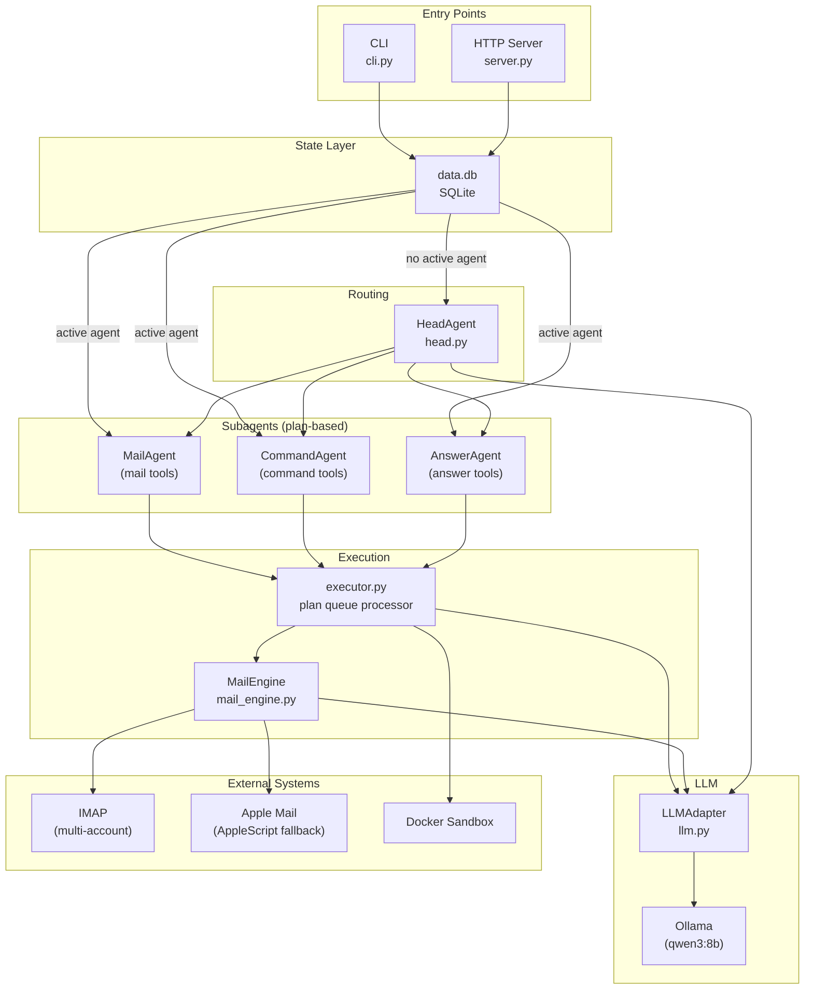

# MyDevTeam

Personal local LLM agent with structured tool dispatch. Runs via Ollama (default: `qwen3:8b`).

## Quick Start

```bash
# CLI
python cli.py chat "check my email"
python cli.py chat "check my email" --session mysession

# Server
./start.sh
python -m src.gateway  # or: uvicorn src.gateway:app --reload

# Tests
.venv/bin/python -m pytest tests/ -v
```

### Web Frontend

The React + TypeScript frontend lives in `../MyWeb`. MyDevTeam exposes the FastAPI API only.

```bash
cd ../MyWeb && npm run dev    # Vite dev server on :5173, proxies /api to :8000
```

## Architecture



### Key Design Decisions

- **Service architecture**: Code split into logical service packages (`auth`, `mail`, `memory`, `search`) with a thin FastAPI gateway. Each service owns its tables, exposes typed error classes, and communicates via Protocol interfaces.
- **Entry points**: `cli/__main__.py` (Typer CLI), `gateway/__main__.py` (FastAPI)
- **Routing**: `HeadAgent` classifies intent, dispatches to scoped subagent (Mail, Command, Answer)
- **Plan-based execution**: Subagents return a `Plan` (ordered list of `Action`s) — the executor runs the full queue, avoiding re-interpretation loops
- **Mail Engine**: `src/core/mail_engine.py` owns inbox state, display, pagination, and execution deterministically. The LLM is only called for recommendations and intent parsing with fresh context (no history accumulates)
- **LLM**: All calls go through `llm.default_adapter` — never call Ollama directly
- **Tools**: `tools/registry.py` defines tools; `tools/schema.py` builds per-agent JSON schemas
- **State**: SQLite (`core/db.py`) for users, sessions, and encrypted email cache — each service accesses only its owned tables
- **Security**: IMAP credentials encrypted at rest with AES-256-GCM, keys derived from user password via PBKDF2

### Project Layout

```
src/
  services/        Logical service packages — each owns its tables
    auth/          User identity, login, IMAP credential encryption
      service.py   AuthService — register, login, IMAP account CRUD
      store.py     UserStore — users table
      models.py    Pydantic models (AuthResult, ImapAccount, etc.)
      errors.py    AuthServiceError subtypes
    mail/          IMAP fetch, email display, move/delete
      service.py   MailService — thin wrapper over MailEngine
      errors.py    MailServiceError subtypes
    memory/        Per-user semantic facts with embeddings
      service.py   MemoryService + MemoryStore — owns memories table
    search/        Web search + URL browsing
      service.py   SearchService — search() and browse()
      providers.py DuckDuckGo, Searx, Google providers
  gateway/         FastAPI server — routes, middleware, session management
    __main__.py    App entry point (python -m src.gateway)
    routes/        auth, memory, search, mail, chat
    session.py     SessionStore — owns sessions table
    middleware.py  require_api_key, get_session_id, get_user_id
  core/            Shared utilities — no business logic
    config.py      Env-based configuration
    crypto.py      AES-GCM encryption for credentials at rest
    db.py          Schema (_init_schema, _connect) — consumed by services
    executor.py     Plan dispatch — routes to agents
    llm.py         LLM adapter (ollama/openai/anthropic)
    mail_engine.py Hybrid mail engine (deterministic state + LLM intent parsing)
    agents/        HeadAgent + subagents (stateless routing)
    tools/         Tool definitions, registry, JSON schema builder
    docker.py      Sandbox execution
tests/          pytest suite
docs/superpowers/
  specs/        Design specifications
  plans/        Implementation plans
```

### Mail Backends

- **IMAP** (`actions/mail_imap.py`): Primary backend, cross-platform. Configured via env vars or encrypted user credentials.
- **AppleScript** (`actions/mail_applescript.py`): macOS-only fallback for Mail.app.
- **Multi-account**: Multiple IMAP accounts supported. First fetch asks which account. Each email carries its `account` field for targeted moves/deletes.
- **Folder resolution**: Provider-specific — `Trash` maps to `[Gmail]/Trash` on Gmail, `Trash` on Yahoo, etc.

### Mail Flow

1. User says "check my email"
2. `MailEngine.fetch()` reads emails via IMAP and stores in session
3. `MailEngine.recommend()` calls LLM once to tag emails as keep/delete/save
4. `MailEngine.display()` renders the current page deterministically (no LLM)
5. User interacts: read, delete, next, previous, page N
6. `MailEngine.handle()` parses intent with current-page context, resolves page-relative indices to cached UIDs
7. Destructive actions return confirmation; confirmed moves update cache and redisplay
8. "done" clears the mail session

### Adding a New Agent

1. Define tools in `tools/registry.py`
2. Subclass `AgentDef` in `agents/`
3. Register in `agents/__init__.py`
4. System prompt and schema are derived automatically

### Adding a New Web Tool

1. Create `../MyWeb/src/tools/<name>/` with a page component
2. Add entry to `../MyWeb/src/tools/registry.ts`
3. Add route in `../MyWeb/src/App.tsx`

## API Endpoints

### Auth & Account
| Method | Path | Description |
|--------|------|-------------|
| POST | `/api/account/register` | Create user (email + password) |
| POST | `/api/account/login` | Login, returns session_id + decrypted IMAP accounts |
| POST | `/api/account/logout` | Logout and delete session |
| GET | `/api/account/me` | Get current user info |
| GET | `/api/imap` | List IMAP accounts (metadata only) |
| POST | `/api/imap` | Add IMAP account (encrypted at rest) |
| DELETE | `/api/imap/{account_id}` | Remove IMAP account |

### Memory
| Method | Path | Description |
|--------|------|-------------|
| POST | `/api/memory` | Add a memory |
| GET | `/api/memory?q=<query>` | Semantic search memories |
| DELETE | `/api/memory/{memory_id}` | Delete a memory |

### Chat & Mail
| Method | Path | Description |
|--------|------|-------------|
| POST | `/api/chat` | Send prompt to agent (routes via HeadAgent) |
| GET | `/api/mail` | Get current inbox page |
| POST | `/api/mail/fetch` | Fetch inbox from IMAP into session |
| GET | `/api/mail/{index}` | Read full email by page-relative index |
| POST | `/api/mail/move` | Move emails to folder (default Trash) |

### Search
| Method | Path | Description |
|--------|------|-------------|
| POST | `/api/search` | Search the web, returns conversational answer + results |
| GET | `/api/search/browse?url=<url>` | Fetch and summarize a URL via LLM |

### Admin
| Method | Path | Description |
|--------|------|-------------|
| POST | `/api/admin/login` | Login as admin (username=admin, password=`$MYDEVTEAM_API_KEY`) |
| GET | `/api/admin/stats` | User/session counts, DB size (requires `X-API-Key`) |
| GET | `/api/admin/users` | List all users |
| GET | `/api/admin/sessions` | List all sessions |
| DELETE | `/api/admin/users/{id}` | Delete user (cascades) |
| DELETE | `/api/admin/sessions/{id}` | Delete session |

*All admin endpoints except login require `X-API-Key` header matching `MYDEVTEAM_API_KEY`.*

## Config

Env vars or `config.py`. Key vars:

| Variable | Default | Purpose |
|----------|---------|---------|
| `LLM_MODEL` | `qwen3:8b` | Ollama model name |
| `MYDEVTEAM_API_KEY` | (empty) | API key for server auth (empty = no auth) |
| `IMAP_<NAME>_HOST/USER/PASS/PORT` | — | Config-based IMAP accounts |
| `ALLOWED_ORIGINS` | `*` | CORS origins |
| `REDIS_URL` | `redis://localhost:6379` | (Reserved for future use) |

## Roadmap

### Done

- [x] Project rename: MyAgent to MyDevTeam
- [x] Directory reorganization: flat files to `src/core/`, `src/cli/`, `src/server/`
- [x] MailEngine: deterministic display, pagination, serialization
- [x] MailEngine: LLM recommendations + intent parsing
- [x] MailEngine: fetch, execute, handle entry point
- [x] MailEngine wired into executor, CLI, server
- [x] Multi-user auth: register/login with password hashing
- [x] IMAP credential encryption (AES-256-GCM at rest)
- [x] SQLite-backed user, session, and email cache stores
- [x] Structured mail API endpoints (GET/POST /api/mail/*)
- [x] Admin endpoints (stats, user/session management) with API key auth
- [x] Mail read endpoint (`GET /api/mail/:index`) for full email body
- [x] Admin page frontend (`../MyWeb`)
- [x] End-to-end testing of full login → IMAP → mail flow
- [x] Service architecture: auth, mail, memory, search services with FastAPI gateway

### Planned

- [ ] Web tool suite frontend (`../MyWeb`)
- [ ] Redis for session storage (optional/future — SQLite WAL mode sufficient for now)

## Changelog

### 2026-04-21

**Service Architecture**
- Split monolith into logical service packages: `services/auth`, `services/mail`, `services/memory`, `services/search`
- FastAPI gateway in `gateway/` assembles all routes (`/api/account/*`, `/api/mail/*`, `/api/memory/*`, `/api/search/*`, `/api/chat`)
- Each service owns its tables and exposes typed error classes mapped to HTTP by the gateway
- `gateway/session.py` owns `SessionStore` (sessions table)
- `gateway/middleware.py` provides `require_api_key`, `get_session_id`, `get_user_id`
- `core/` retained for shared utilities only (config, crypto, llm, executor, agents, tools, docker)
- Fixed duplicate `recall`/`list_memories`/`forget` bug in memory service

### 2026-04-20

**Directory reorganization**
- Moved flat top-level Python files into `src/core/`, `src/cli/`, `src/server/`
- Added symlinks (`cli`, `core`, `server`) for backward compatibility

**MailEngine + auth system**
- Implemented hybrid mail engine: deterministic state/display, LLM for intent parsing
- Added user registration/login with PBKDF2 password hashing
- Added AES-256-GCM encryption for IMAP credentials at rest
- Added SQLite stores for users, sessions, email cache
- Added structured mail API endpoints
- Fixed CLI session loading for local (no-auth) mode

**Admin login endpoint**
- `POST /api/admin/login` accepts username=admin + password=`$MYDEVTEAM_API_KEY`
- Other admin endpoints still require `X-API-Key` header

**Admin & mail read endpoints**
- Added admin API endpoints (stats, users, sessions, delete) with API key auth
- Added `GET /api/mail/{index}` for reading full email body by page index
- Added confirm flow: pending actions stored in session DB between requests

**Renamed project: MyAgent to MyDevTeam**
- Updated all file references, env vars, Docker container names
- Historical plan docs left unchanged
